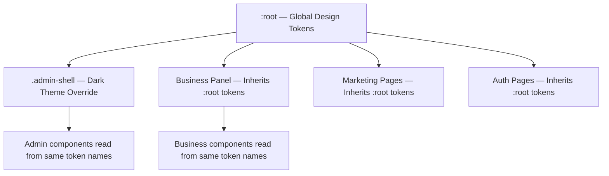

# Design Document: SaaS UI Redesign

## Overview

This design establishes a comprehensive design system for TelcoRetain that transforms the existing rapid-prototype UI into a polished, professional SaaS product. The approach introduces a centralized design token system in CSS custom properties, defines consistent component styling patterns, creates reusable state components (Empty, Error, Skeleton), refines navigation with grouped sidebars and breadcrumbs, and elevates marketing/auth pages to conversion-quality experiences.

The architecture remains within the current stack: a single global `styles.css` file using CSS custom properties, with Framer Motion for JS-driven animations and Lucide React for iconography. No component libraries are introduced.

### Key Design Decisions

1. **Single CSS file with token layers** — tokens defined on `:root`, dark theme overrides scoped to `.admin-shell` class, responsive overrides in media queries
2. **Class-based component API** — reusable components use predictable CSS classes (`.empty-state`, `.error-state`, `.skeleton`) composed with utility modifiers
3. **Framer Motion for orchestrated animations** — page transitions, sidebar reveals, and staggered lists stay in React; CSS handles micro-interactions (hover, focus, transitions)
4. **Progressive enhancement for responsive** — desktop-first grid layouts that reflow at 980px and 620px breakpoints via existing media queries

## Architecture

### Token Layer Architecture



The token system uses a single namespace of CSS custom properties. Components reference tokens by semantic name (e.g., `var(--color-primary)`) and the active scope determines the resolved value:

- **`:root`** — defines all tokens with light-theme Business Panel values
- **`.admin-shell`** — overrides color tokens with dark-theme values; spacing, radius, and shadow tokens remain inherited
- **Media queries** — override spacing and layout tokens at breakpoints

### File Structure (CSS)

All styles remain in a single `src/styles.css` file, organized into clearly commented sections:

```
/* 1. DESIGN TOKENS — :root variables */
/* 2. DESIGN TOKENS — Admin dark theme override */
/* 3. BASE RESET & TYPOGRAPHY */
/* 4. COMPONENT STYLES — Buttons, Inputs, Cards, Tables, Badges */
/* 5. STATE COMPONENTS — Skeleton, Empty, Error */
/* 6. LAYOUT — AppShell, Sidebar, Topbar, Breadcrumbs */
/* 7. BUSINESS PANEL — Pages and overrides */
/* 8. ADMIN PANEL — Pages and overrides */
/* 9. MARKETING PAGES — Landing, About, Pricing, Contact */
/* 10. AUTH PAGES */
/* 11. ANIMATIONS & TRANSITIONS */
/* 12. RESPONSIVE — 980px breakpoint */
/* 13. RESPONSIVE — 620px breakpoint */
/* 14. ACCESSIBILITY — prefers-reduced-motion */
```

### Component File Structure (React)

New shared components added to `src/components/`:

```
src/components/
├── EmptyState.tsx
├── ErrorState.tsx
├── SkeletonLoader.tsx
├── Breadcrumbs.tsx
├── SidebarGroup.tsx
└── MobileNav.tsx
```

## Components and Interfaces

### 1. Design Token System (CSS Custom Properties)

```css
:root {
  /* Color — Primary */
  --color-primary: #1d8a8a;
  --color-primary-hover: #167272;
  --color-primary-subtle: #e6f5f5;

  /* Color — Neutrals */
  --color-neutral-50: #f8fafc;
  --color-neutral-100: #f1f5f9;
  --color-neutral-200: #e2e8f0;
  --color-neutral-300: #cbd5e1;
  --color-neutral-400: #94a3b8;
  --color-neutral-500: #64748b;
  --color-neutral-600: #475569;
  --color-neutral-700: #334155;
  --color-neutral-800: #1e293b;
  --color-neutral-900: #0f172a;

  /* Color — Semantic */
  --color-success: #16a34a;
  --color-success-subtle: #dcfce7;
  --color-warning: #d97706;
  --color-warning-subtle: #fef3c7;
  --color-danger: #dc2626;
  --color-danger-subtle: #fee2e2;

  /* Color — Surface */
  --color-surface: #ffffff;
  --color-surface-raised: #f8fafc;
  --color-background: #f1f5f9;
  --color-border: #e2e8f0;

  /* Spacing */
  --space-1: 4px;
  --space-2: 8px;
  --space-3: 12px;
  --space-4: 16px;
  --space-5: 20px;
  --space-6: 24px;
  --space-7: 32px;
  --space-8: 40px;
  --space-9: 48px;
  --space-10: 64px;

  /* Typography — Size */
  --text-xs: 12px;
  --text-sm: 13px;
  --text-base: 14px;
  --text-md: 15px;
  --text-lg: 18px;
  --text-xl: 20px;
  --text-2xl: 24px;
  --text-3xl: 32px;
  --text-4xl: 40px;

  /* Typography — Line Height */
  --leading-tight: 1.2;
  --leading-normal: 1.5;

  /* Border Radius */
  --radius-sm: 4px;
  --radius-md: 6px;
  --radius-lg: 8px;
  --radius-xl: 12px;
  --radius-2xl: 16px;

  /* Shadows */
  --shadow-sm: 0 1px 2px rgba(0, 0, 0, 0.05);
  --shadow-md: 0 4px 8px rgba(0, 0, 0, 0.08);
  --shadow-lg: 0 8px 24px rgba(0, 0, 0, 0.1);
  --shadow-xl: 0 16px 48px rgba(0, 0, 0, 0.12);

  /* Transitions */
  --duration-fast: 150ms;
  --duration-normal: 200ms;
  --duration-slow: 300ms;
}
```

### 2. Admin Dark Theme Override

```css
.admin-shell {
  --color-primary: #3b82f6;
  --color-primary-hover: #2563eb;
  --color-primary-subtle: rgba(59, 130, 246, 0.15);

  --color-neutral-50: #0f172a;
  --color-neutral-100: #1e293b;
  --color-neutral-200: #334155;
  --color-neutral-300: #475569;
  --color-neutral-400: #64748b;
  --color-neutral-500: #94a3b8;
  --color-neutral-600: #cbd5e1;
  --color-neutral-700: #e2e8f0;
  --color-neutral-800: #f1f5f9;
  --color-neutral-900: #f8fafc;

  --color-success: #34d399;
  --color-success-subtle: rgba(52, 211, 153, 0.15);
  --color-warning: #fbbf24;
  --color-warning-subtle: rgba(251, 191, 36, 0.15);
  --color-danger: #fca5a5;
  --color-danger-subtle: rgba(252, 165, 165, 0.15);

  --color-surface: #1e293b;
  --color-surface-raised: #334155;
  --color-background: #0f172a;
  --color-border: #334155;
}
```

### 3. Reusable State Components

#### EmptyState Component

```tsx
// src/components/EmptyState.tsx
import { LucideIcon } from "lucide-react";

interface EmptyStateProps {
  icon: LucideIcon;
  heading: string;
  description: string;
  actionLabel?: string;
  onAction?: () => void;
}

export function EmptyState({ icon: Icon, heading, description, actionLabel, onAction }: EmptyStateProps) {
  return (
    <div className="empty-state">
      <Icon size={48} className="empty-state-icon" />
      <h3 className="empty-state-heading">{heading}</h3>
      <p className="empty-state-description">{description}</p>
      {actionLabel && onAction && (
        <button className="btn btn-primary" onClick={onAction}>
          {actionLabel}
        </button>
      )}
    </div>
  );
}
```

#### ErrorState Component

```tsx
// src/components/ErrorState.tsx
import { AlertCircle } from "lucide-react";

interface ErrorStateProps {
  heading: string;
  description: string;
  onRetry: () => void;
}

export function ErrorState({ heading, description, onRetry }: ErrorStateProps) {
  return (
    <div className="error-state">
      <AlertCircle size={48} className="error-state-icon" />
      <h3 className="error-state-heading">{heading}</h3>
      <p className="error-state-description">{description}</p>
      <button className="btn btn-primary" onClick={onRetry}>
        Retry
      </button>
    </div>
  );
}
```

#### SkeletonLoader Component

```tsx
// src/components/SkeletonLoader.tsx

interface SkeletonProps {
  variant: "text" | "card" | "table-row" | "chart";
  count?: number;
  columns?: number;
}

export function SkeletonLoader({ variant, count = 1, columns = 4 }: SkeletonProps) {
  if (variant === "table-row") {
    return (
      <div className="skeleton-table">
        {Array.from({ length: count }).map((_, i) => (
          <div key={i} className="skeleton-row">
            {Array.from({ length: columns }).map((_, j) => (
              <div key={j} className="skeleton-cell skeleton-pulse" />
            ))}
          </div>
        ))}
      </div>
    );
  }

  if (variant === "card") {
    return (
      <div className="skeleton-grid">
        {Array.from({ length: count }).map((_, i) => (
          <div key={i} className="skeleton-card skeleton-pulse" />
        ))}
      </div>
    );
  }

  if (variant === "chart") {
    return <div className="skeleton-chart skeleton-pulse" />;
  }

  return (
    <div className="skeleton-text-group">
      {Array.from({ length: count }).map((_, i) => (
        <div key={i} className="skeleton-text skeleton-pulse" />
      ))}
    </div>
  );
}
```

#### Breadcrumbs Component

```tsx
// src/components/Breadcrumbs.tsx
import { useLocation } from "react-router-dom";

const MAX_LEVELS = 4;

const labelMap: Record<string, string> = {
  app: "Business",
  admin: "Admin",
  dashboard: "Dashboard",
  customers: "Customers",
  predict: "Churn Prediction",
  explain: "Explainable AI",
  recommendations: "Recommendations",
  campaigns: "Campaigns",
  analytics: "Analytics",
  reports: "Reports",
  settings: "Settings",
  users: "User Management",
  roles: "Roles & Permissions",
  datasets: "Datasets",
  models: "Model Registry",
  "model-monitoring": "Model Monitoring",
  "audit-logs": "Audit Logs",
  "api-monitoring": "API Monitoring",
  database: "Database Health",
  security: "Security Center",
  notifications: "Notifications",
};

export function Breadcrumbs() {
  const location = useLocation();
  const segments = location.pathname.split("/").filter(Boolean);

  const crumbs = segments.map((seg) => labelMap[seg] ?? seg);

  const display =
    crumbs.length > MAX_LEVELS
      ? [crumbs[0], "...", ...crumbs.slice(-2)]
      : crumbs;

  return (
    <nav className="breadcrumbs" aria-label="Breadcrumb">
      {display.map((crumb, i) => (
        <span key={i} className="breadcrumb-item">
          {i > 0 && <span className="breadcrumb-sep">/</span>}
          <span>{crumb}</span>
        </span>
      ))}
    </nav>
  );
}
```

#### SidebarGroup Component

```tsx
// src/components/SidebarGroup.tsx
import { LucideIcon } from "lucide-react";
import { NavLink } from "react-router-dom";

interface NavItem {
  to: string;
  icon: LucideIcon;
  label: string;
}

interface SidebarGroupProps {
  label: string;
  items: NavItem[];
}

export function SidebarGroup({ label, items }: SidebarGroupProps) {
  return (
    <div className="sidebar-group">
      <span className="sidebar-group-label">{label}</span>
      {items.map((item) => (
        <NavLink
          key={item.to}
          to={item.to}
          className={({ isActive }) =>
            `nav-item ${isActive ? "active" : ""}`
          }
        >
          <item.icon size={18} />
          <span>{item.label}</span>
        </NavLink>
      ))}
    </div>
  );
}
```

#### MobileNav Component

```tsx
// src/components/MobileNav.tsx
import { useState } from "react";
import { motion, AnimatePresence } from "framer-motion";
import { Menu, X } from "lucide-react";

interface MobileNavProps {
  children: React.ReactNode;
}

export function MobileNav({ children }: MobileNavProps) {
  const [open, setOpen] = useState(false);

  return (
    <>
      <button
        className="mobile-nav-toggle"
        onClick={() => setOpen(!open)}
        aria-label={open ? "Close navigation" : "Open navigation"}
      >
        {open ? <X size={20} /> : <Menu size={20} />}
      </button>
      <AnimatePresence>
        {open && (
          <>
            <motion.div
              className="mobile-nav-backdrop"
              initial={{ opacity: 0 }}
              animate={{ opacity: 1 }}
              exit={{ opacity: 0 }}
              onClick={() => setOpen(false)}
            />
            <motion.aside
              className="mobile-nav-drawer"
              initial={{ x: -280 }}
              animate={{ x: 0 }}
              exit={{ x: -280 }}
              transition={{ duration: 0.3, ease: [0.25, 0.1, 0.25, 1] }}
            >
              {children}
            </motion.aside>
          </>
        )}
      </AnimatePresence>
    </>
  );
}
```

### 4. Component Styling Patterns

#### Buttons

Five button variants with consistent sizing:

| Variant | Class | Background | Text | Border |
|---------|-------|-----------|------|--------|
| Primary | `.btn-primary` | `--color-primary` | white | none |
| Secondary | `.btn-secondary` | `--color-neutral-100` | `--color-neutral-800` | `--color-border` |
| Outline | `.btn-outline` | transparent | `--color-primary` | `--color-primary` |
| Ghost | `.btn-ghost` | transparent | `--color-neutral-600` | none |
| Icon | `.btn-icon` | `--color-neutral-100` | `--color-neutral-600` | none |

Sizes: `.btn-sm` (36px height, 12px padding), default (40px, 16px), `.btn-lg` (48px, 20px).

All buttons receive:
- `border-radius: var(--radius-md)`
- `transition: background-color var(--duration-fast) ease-in-out, transform var(--duration-fast)`
- `:hover` applies the hover token variant
- `:active` applies `transform: scale(0.97)`
- `:disabled` applies `opacity: 0.5; pointer-events: none`

#### Cards

All card variants (`.metric-card`, `.panel`, `.item-card`, `.table-panel`) receive:
- `border-radius: var(--radius-lg)`
- `border: 1px solid var(--color-border)`
- `box-shadow: var(--shadow-sm)`
- `background: var(--color-surface)`

Clickable cards additionally receive:
- `transition: box-shadow var(--duration-normal), transform var(--duration-normal)`
- `:hover` → `box-shadow: var(--shadow-md); transform: translateY(-2px)`

#### Form Inputs

- Height: 40px
- Padding: `0 var(--space-3)`
- Border: `1px solid var(--color-neutral-300)`
- Border-radius: `var(--radius-md)`
- Focus: `outline: 2px solid var(--color-primary); outline-offset: 2px`
- Placeholder: `color: var(--color-neutral-400)`
- Disabled: `opacity: 0.5; pointer-events: none`

### 5. Navigation Refinements

#### Sidebar Grouping

Business Panel sidebar items are organized into labeled groups:

| Group Label | Items |
|-------------|-------|
| Analytics | Dashboard, Analytics Dashboard, Reports |
| Customers | Customer Explorer, Churn Prediction, Explainable AI |
| Management | Recommendation Center, Campaign Management |
| Settings | Profile Settings |

Admin Panel sidebar items are grouped:

| Group Label | Items |
|-------------|-------|
| Overview | Dashboard |
| Users & Access | User Management, Roles & Permissions |
| ML Platform | Dataset Management, Model Registry, Model Monitoring |
| Infrastructure | System Settings, API Monitoring, Database Health, Security Center |
| Audit | Audit Logs, Notification Settings |

Group labels use: `font-size: var(--text-xs)`, `text-transform: uppercase`, `font-weight: 600`, `color: var(--color-neutral-500)`, `margin-top: var(--space-5)`.

#### Active State

- **Business Panel**: Left 3px border accent in `--color-primary`, background `--color-primary-subtle`
- **Admin Panel**: Full background `--color-primary`, white text

#### Responsive Sidebar

Below 980px:
- Sidebar hides off-screen (`transform: translateX(-100%)`)
- Hamburger toggle appears in topbar
- Click opens sidebar as overlay with backdrop (`.mobile-nav-backdrop`)
- Click backdrop or toggle again closes with animation

### 6. Dashboard Layout Patterns

#### Business Dashboard

```
┌────────────────────────────────────────────────────────┐
│ Page Title + Breadcrumbs                                │
├──────────┬──────────┬──────────┬──────────┤
│ KPI Card │ KPI Card │ KPI Card │ KPI Card │
├──────────┴──────────┴──────────┴──────────┤
│ Section: "Churn Analysis"                              │
│ ┌───────────────────┐ ┌───────────────────┐│
│ │ Chart (line)      │ │ Chart (bar)       ││
│ └───────────────────┘ └───────────────────┘│
├────────────────────────────────────────────────────────┤
│ Section: "At-Risk Customers"                           │
│ ┌──────────────────────────────────────────┐│
│ │ Table with sortable columns              ││
│ └──────────────────────────────────────────┘│
└────────────────────────────────────────────────────────┘
```

KPI Grid: `grid-template-columns: repeat(4, 1fr)` on >980px, `repeat(2, 1fr)` at 620–980px, `1fr` below 620px.

Each metric card displays:
- Label (font-size xs, muted color)
- Value (font-size 2xl, font-weight 700)
- Trend indicator: arrow icon + percentage in success/danger/muted color

Section headings: `font-size: var(--text-lg)`, `font-weight: 600`, spacing `var(--space-7)` between groups.

#### Admin Dashboard

Same grid pattern with dark surface cards. KPI cards include an icon container (48px square, rounded-xl, tinted background) + label + value.

### 7. Marketing Page Structure

#### Landing Page

```
┌─────────────────────────────────────────┐
│ Sticky Nav: Logo | Links | Sign In CTA  │
├─────────────────────────────────────────┤
│ Hero: Gradient overlay on background    │
│   Headline (max 10 words)               │
│   Sub-headline (max 25 words)           │
│   [Get Started] [View Pricing]          │
├─────────────────────────────────────────┤
│ Stats Bar: 3–4 metrics (overlapping)    │
├─────────────────────────────────────────┤
│ Features: 3 or 6 cards in grid          │
│   Icon | Heading | Description          │
├─────────────────────────────────────────┤
│ Final CTA: Dark bg, heading, button     │
├─────────────────────────────────────────┤
│ Footer                                  │
└─────────────────────────────────────────┘
```

Hero uses `min-height: calc(100vh - 64px)` with `display: flex; align-items: center` to ensure above-fold on 768px+ viewports. Background image with gradient overlay (`linear-gradient(135deg, ...)`) maintaining 7:1 contrast against white text.

#### Pricing Page

3-column grid with equal-height cards. Recommended plan receives:
- `border: 2px solid var(--color-primary)`
- `box-shadow: var(--shadow-lg)`
- Badge positioned `top: -14px` with `position: absolute`
- Primary button variant; others get outline variant

Below 980px: single column, recommended plan rendered first with `order: -1`.

#### About and Contact Pages

- About: Hero + mission statement + 3-column values grid + tech stack section
- Contact: 2-column layout (info left, form right), stacks to 1 column below 980px
- Form validation: name (1–100 chars), email (standard format), message (1–2000 chars)
- Inline error below each invalid field on blur/submit

### 8. Auth Page Improvements

Layout:
- Full-height background with gradient overlay (same pattern as existing)
- Centered card: `max-width: 420px`, `padding: var(--space-7)`
- Card contains: brand logo, heading, form fields with labels, submit button, footer links
- Vertical spacing: `var(--space-6)` between form groups

Interactions:
- Field validation on blur and submit; inline error below field in `--color-danger`, `font-size: var(--text-sm)`, within 100ms
- Submit button shows loading spinner while submitting; disabled state
- 15-second timeout: re-enables button, shows timeout error message
- Auth failure: inline error above submit button, preserves field values except password (cleared)
- Focus ring: `2px solid var(--color-primary)` with `2px offset`

### 9. Animation/Transition System

#### CSS Transitions (micro-interactions)

All interactive elements receive:
```css
transition: background-color var(--duration-fast) ease-in-out,
            border-color var(--duration-fast) ease-in-out;
```

Card hover:
```css
transition: box-shadow var(--duration-normal) ease,
            transform var(--duration-normal) ease;
```

#### Framer Motion (orchestrated animations)

| Animation | Properties | Duration | Easing |
|-----------|-----------|----------|--------|
| Page enter | opacity 0→1, y 8→0 | 200ms | ease-out |
| Modal/dropdown open | opacity 0→1, scale 0.95→1 | 150ms | ease-out |
| Modal/dropdown close | opacity 1→0, scale 1→0.95 | 150ms | ease-in |
| Toast enter | slide from top-right | 300ms | ease-out |
| Sidebar reveal | x -280→0 | 300ms | cubic-bezier(0.25, 0.1, 0.25, 1) |

#### Reduced Motion

```css
@media (prefers-reduced-motion: reduce) {
  *, *::before, *::after {
    animation-duration: 0ms !important;
    transition-duration: 0ms !important;
  }
}
```

### 10. Responsive Design Approach

#### Breakpoint Strategy

| Breakpoint | Target | Key Changes |
|-----------|--------|-------------|
| >980px | Desktop | Full sidebar, 4-col grids, full padding |
| 620–980px | Tablet | Collapsed sidebar (overlay), 2-col grids, reduced spacing |
| <620px | Mobile | Hamburger menu, 1-col grids, compact padding |

#### Layout Adaptations at 980px

- AppShell grid changes from `260px 1fr` to `1fr`
- Sidebar hidden, hamburger toggle visible in topbar
- Metric grids: `repeat(4, 1fr)` → `repeat(2, 1fr)`
- Multi-column layouts (two-column, split-panels): collapse to 1 column
- Marketing nav: remains inline but condensed
- Pricing grid: stacks vertically, recommended plan first
- Touch targets: all interactive elements maintain minimum 44×44px

#### Layout Adaptations at 620px

- Metric grids: `repeat(2, 1fr)` → `1fr`
- Page padding: `28px` → `16px`
- Section spacing: `32px` → `20px`
- Marketing nav: collapses to hamburger drawer
- Stats bar: `repeat(4, 1fr)` → `repeat(2, 1fr)`
- Features grid: stacks to 1 column
- Table cells: reduced padding

#### Overflow Prevention

- All containers use `min-width: 0` in grid contexts
- Images use `max-width: 100%`
- Tables wrapped in `overflow-x: auto` containers
- No fixed widths on content elements

## Data Models

This feature does not introduce new data models. It operates on the existing frontend state and API response structures. Key interfaces consumed:

```typescript
// Existing auth state (Zustand)
interface User {
  id: string;
  email: string;
  full_name: string;
  role?: { name: string };
}

// Metric card data shape (used by dashboards)
interface MetricCard {
  label: string;
  value: string | number;
  trend: number; // percentage change, positive/negative/zero
  icon?: LucideIcon;
}

// Navigation item shape (used by SidebarGroup)
interface NavItem {
  to: string;
  icon: LucideIcon;
  label: string;
}

// Sidebar group shape
interface NavGroup {
  label: string;
  items: NavItem[];
}

// Contact form data
interface ContactFormData {
  name: string;     // 1–100 characters
  email: string;    // valid email format
  message: string;  // 1–2000 characters
}
```

## Error Handling

### Data Fetch Errors

When any API call fails (network error, 4xx, 5xx):
1. The page section displays the `ErrorState` component with:
   - `AlertCircle` icon (48px, `--color-danger`)
   - Human-readable heading (e.g., "Failed to load customers")
   - Descriptive body explaining what went wrong
   - "Retry" button that re-triggers the fetch and shows skeleton loading state

### Form Submission Errors

- **Validation errors**: Inline below each invalid field, `--color-danger`, `font-size: var(--text-sm)`
- **Network/server errors**: Inline message above submit button (auth pages) or below form (contact page)
- **Timeout (15s)**: Re-enable submit button, show timeout error message
- All form errors preserve user-entered values (except password fields on auth failure)

### Empty Data Handling

- Tables/lists with zero items → `EmptyState` with contextual icon, heading, description, and primary action
- Search returning zero results → `EmptyState` with search icon, "No results match" heading, and "Clear Filters" button
- Charts receiving null/empty data → `EmptyState` instead of empty chart area

### Loading State Handling

- Skeleton loaders render synchronously on mount (no flash of empty content)
- Skeletons match the layout dimensions of actual content to prevent CLS
- Fade transition (150ms) when real content replaces skeleton

## Testing Strategy

### Why Property-Based Testing Does Not Apply

This feature is a **UI redesign** focused on CSS architecture, visual component styling, layout patterns, and animation polish. The work is declarative styling and rendering — not pure functions with universal input/output properties. Specifically:

- Design token definitions are static CSS declarations (no varying input)
- Component styling is visual rendering verified by snapshot/visual regression
- Responsive breakpoints are layout behavior best tested with viewport simulations
- Animations are timing/visual effects, not data transformations

### Recommended Testing Approach

#### 1. Visual Regression Tests

- Use Playwright or Cypress with screenshot comparisons for key pages at each breakpoint (1280px, 980px, 620px, 375px)
- Capture: Landing page, Business Dashboard, Admin Dashboard, Auth pages, EmptyState, ErrorState, SkeletonLoader
- Run against a Storybook-like fixture or dev server with mocked data

#### 2. Snapshot Tests (Component)

- Render `EmptyState`, `ErrorState`, `SkeletonLoader`, `Breadcrumbs`, `SidebarGroup` with various props
- Assert HTML structure matches expected snapshot
- Detect unintended markup changes

#### 3. Example-Based Unit Tests

| Area | Test Cases |
|------|-----------|
| Breadcrumbs | Renders correct segments from path; truncates to 4 levels with "..." |
| EmptyState | Renders icon, heading, description; shows button when action provided |
| ErrorState | Renders danger icon/heading; calls onRetry when button clicked |
| SkeletonLoader | Renders correct number of rows/cards; applies pulse class |
| MobileNav | Toggle opens/closes drawer; backdrop click closes |
| Contact form validation | Rejects empty name; rejects invalid email; accepts valid input |
| Metric card trend | Shows up arrow + success for positive; down arrow + danger for negative |

#### 4. Accessibility Tests

- Run axe-core on all pages to verify contrast ratios (4.5:1 body, 3:1 secondary)
- Verify keyboard navigation through sidebar items (focus indicators)
- Verify reduced-motion media query disables animations
- Verify touch targets ≥ 44px on mobile viewports

#### 5. Integration Tests

- Page loads: verify skeleton → real content transition occurs
- Error state: mock API failure → verify ErrorState renders with retry button
- Responsive: resize viewport → verify sidebar collapse and grid reflow
- Form flows: submit auth form with invalid data → verify inline errors appear
